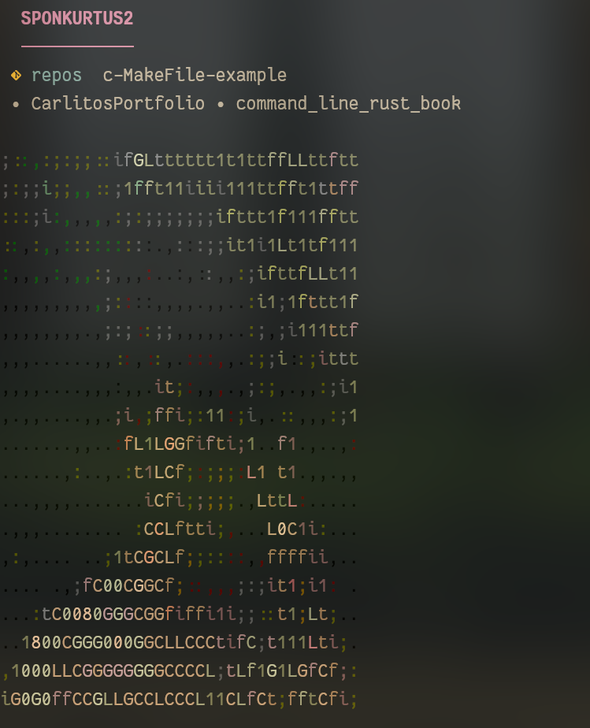

## 📸 Screenshots




## 🛠 What is this?

GitFetchGo is a command-line tool that displays your Git repository information in a visually appealing way, similar to Neofetch. It shows details like branch status, recent commits, and repository statistics with ASCII art styling.

## 🛠️ Built With

- [Go](https://golang.org/) - The programming language used
- [fatih/color](https://github.com/fatih/color) - Color support for terminal output
- [image2ascii](https://github.com/qeesung/image2ascii) - Converting images to ASCII art

## 📝 Dependencies

To run this project, you'll need:
- Go 1.16 or higher
- The following Go packages:
  ```bash
  go get github.com/fatih/color
  go get github.com/qeesung/image2ascii
  ```

### Installation

* Clone the repo
````bash
$ git clone https://github.com/sponkurtus2/gitFetchGo.git
````
* Use the installer
````bash
$ bash ./install.sh
````
* Run
````bash
$ gitFetchGo <github-username>
````

## Support me 🤝

[](https://www.buymeacoffee.com/sponkurtus2)


## 📝 License

This project is licensed under the MIT License - see the [LICENSE](LICENSE) file for details

## 🙏 Acknowledgments

- Inspired by [Neofetch](https://github.com/dylanaraps/neofetch)
